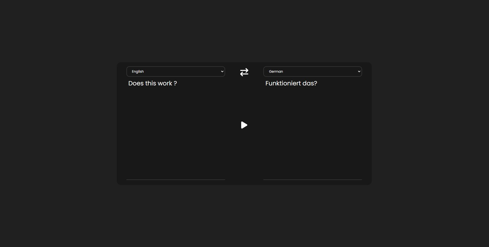

# Translate App

Fast and right translate application.

**Live demo: [https://translatebyase.netlify.app/](https://translatebyase.netlify.app/)**

## Built with

- [React](https://reactjs.org/)

- [Microsoft Translate](https://rapidapi.com/microsoft-azure-org-microsoft-cognitive-services/api/microsoft-translator-text/)

## Getting Started

Clone the repository

```
git clone https://github.com/AhmedSemih/Translate-App
```

After getting the starter files, you need to go the file directory and run

```
npm install
```

and after start the dev server

```
npm start
```